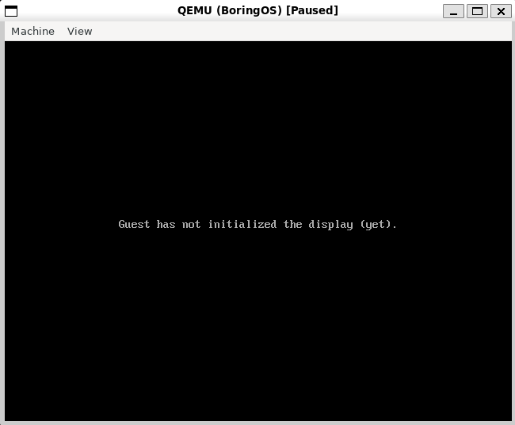
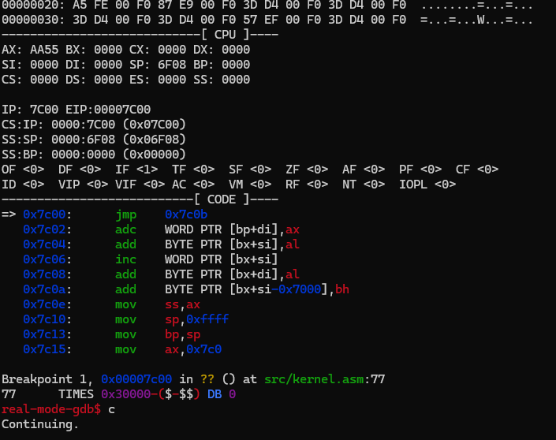
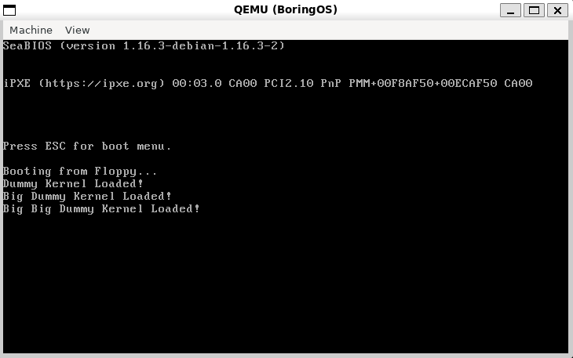

# Boring OS

## Description

This repository contains the code for the Boring OS, that is not a Operating System yet. It is completely original, but following the instructions of [COS 318 Operating Systems Princeton Course](https://www.cs.princeton.edu/courses/archive/fall15/cos318/projects.html). None of their code was used.

## Development setup

I run this code on a Ubuntu WSL2 running in Windows 10/11 machines. So, you can run it on other environments, maybe if you do some changes. 

### Dependencies

- QEMU x86
- NASM
- GDB
- MESA Utils
- GCC/G++

#### Instaling the depencencies

```bash
# Install the dependencies
sudo apt install aqemu qemu-system qemu-system qemu-system-x86 virt-manager bridge-utils nasm gdb mesa-utils build-essential
```

#### KVM on WSL2

If you, like me, are using WSL2, chances are you need to allow your dist to enable KVM. Following [these instructions](https://serverfault.com/questions/1043441/how-to-run-kvm-nested-in-wsl2-or-vmware), we must edit /etc/wsl.conf file adding the following content:


```console
[boot]
systemd=true
command = /bin/bash -c 'chown -v root:kvm /dev/kvm && chmod 660 /dev/kvm'

[wsl2]
nestedVirtualization=true
```

After that, close all opened files in Ubuntu, open a new PowerShell on your Windows and run:

```console
wsl.exe --shutdown
```

## Build

At the project folder, run:

```bash
make clean && make
```

## Run

At the project folder, run:

```bash
./util/VM_BoringOS.sh
```

It will open a QEMU instance, but it will be freezed, like this:


QEMU will be waiting some gdb connect to it to continue the execution. Open another shell and, at the project folder, run:

```bash
./util/debug_BoringOS.sh
```

It is expected that you see the following content on you console:

It will open a QEMU instance, but it will be freezed, like this:


You can do whatever you do with gdb. If you want to continue the execution, hit c and press ENTER:


At this present moment, QEMU must be like the following figure:
